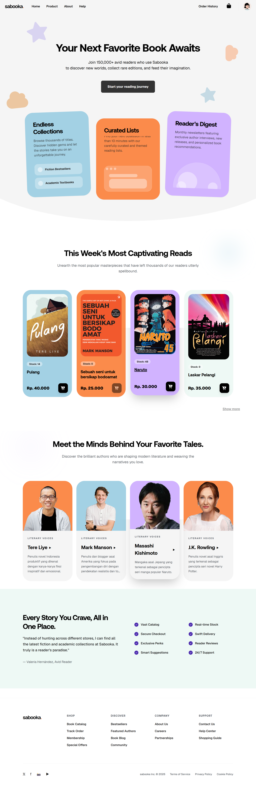

  <a href="https://github.com/fatiya17/sabooka-bnsp">
    <picture>
      <source media="(prefers-color-scheme: dark)" srcset="./logo-white.svg">
      <source media="(prefers-color-scheme: light)" srcset="./logo-black.svg">
      
    </picture>
  </a>

**Sabooka BookStore** is a full-stack, decoupled digital bookstore platform designed to manage book catalogs and facilitate seamless online purchasing transactions. 

This project was built specifically to fulfill the requirements of the **Ujian Kompetensi (UJK) BNSP - Skema Junior Web Developer (JWD)**, demonstrating proficiency in both backend API development and modern frontend interfaces.

 

## 📖 About The Project

Sabooka BookStore provides a structured and secure environment for two main actors: **Admins** and **Users (Customers)**. 

By implementing a modern separation of concerns (Decoupled Architecture), the system relies on a robust RESTful API generated by Laravel, which is then consumed by a highly interactive Single Page Application (SPA) built with React.js and Vite.

## 🚀 Key Features

### 👨‍💻 Admin Panel (Management)
Admins have full access rights to control and monitor system operations securely.
* **📚 Book & Genre Management:** Complete CRUD (Create, Read, Update, Delete) capabilities for managing book catalogs, authors, and genres.
* **👥 User Monitoring:** View and manage the list of all registered users within the application.
* **🛒 Transaction Dashboard:** Track and review all incoming book orders and payment statuses from different users in real-time.

### 👤 User Interface (Customer)
Users get a smooth shopping experience to explore and buy books.
* **🔐 Secure Authentication:** JWT/Sanctum based Registration and Login system for secure session management.
* **🔍 Smart Search:** Quickly find specific books by title or keyword directly from the catalog.
* **🛍️ Dynamic Cart System:** Add books to the cart, update quantities, and view real-time subtotal calculations before checkout.
* **💳 Payment & Checkout:** Streamlined order completion process, generating clear transaction invoices.
* **💬 Contact & About:** Informative pages detailing the bookstore's profile and a contact form to reach the admin.

## 🛠️ Tech Stack

### Frontend (Client-Side / UI)
* **React.js (with Vite):** The core UI framework for building a fast, dynamic Single Page Application (SPA).
* **Tailwind CSS:** Utility-first CSS framework for highly responsive and modern styling.
* **Axios:** For handling asynchronous HTTP REST API requests to the backend.
* **React Router:** For seamless client-side navigation without page reloads.

### Backend (Server-Side / API)
* **PHP & Laravel 11:** The core backend framework handling MVC architecture and routing.
* **Laravel Sanctum:** For secure, token-based API authentication.
* **MySQL:** Relational Database Management System for data integrity (Users, Books, Genres, Transactions).
* **Eloquent ORM:** Laravel's Object-Relational Mapper for intuitive database queries.

---

## 📖 Usage Guide

1. **Exploring the Catalog:**
   * Guests can browse the book catalog, read book details, and learn about the store via the "About Us" page without logging in.
   
2. **Making a Purchase:**
   * Click **"Login"** or **"Register"** to authenticate.
   * Browse the catalog and click **"Add to Cart"** on your desired books.
   * Navigate to your **Cart**, review your items, and click **"Checkout"** to generate an order invoice.

3. **Admin Controls:**
   * Log in using an Administrator account.
   * Access the **Dashboard** to add new book inventory, manage categories, or monitor user transactions.

---

## ⚠️ Notes & Disclaimer

* **Certification Project:** This application was developed specifically as an assessment project for the BNSP Junior Web Developer certification. 
* **Mock Data:** The books, transactions, and user data within the live demo (if provided) are populated using Database Seeders and Faker for demonstration purposes.

---

## 🤝 Credits & Contribution

**Sabooka BookStore** is designed and developed by:

* **👩‍💻 Fatiya Labibah** - *Fullstack Developer*

This project stands as a portfolio piece showcasing the integration of modern PHP Backend APIs with modern JavaScript Frontend ecosystems.

---
*© 2026 Sabooka BookStore. Developed for BNSP JWD Assessment.*